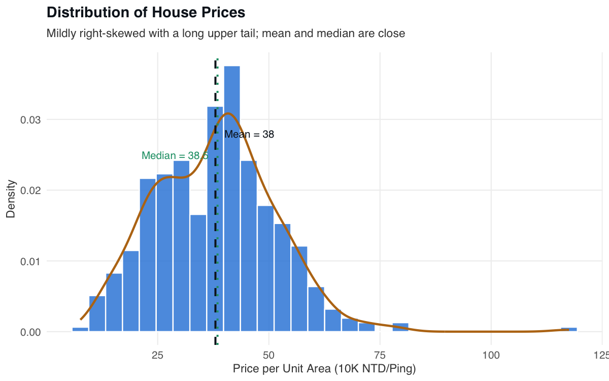
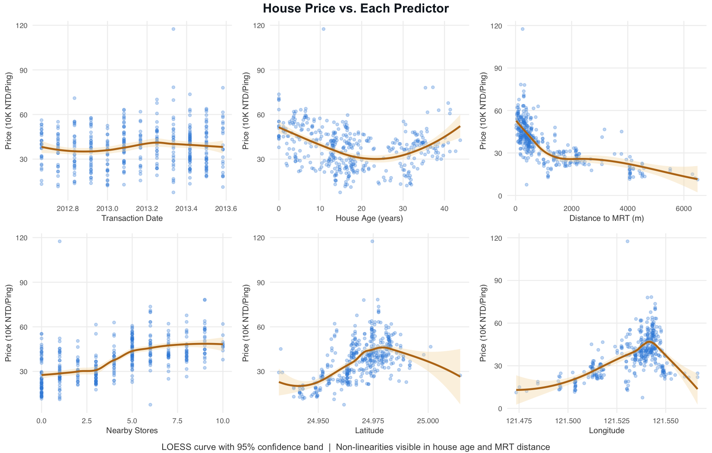
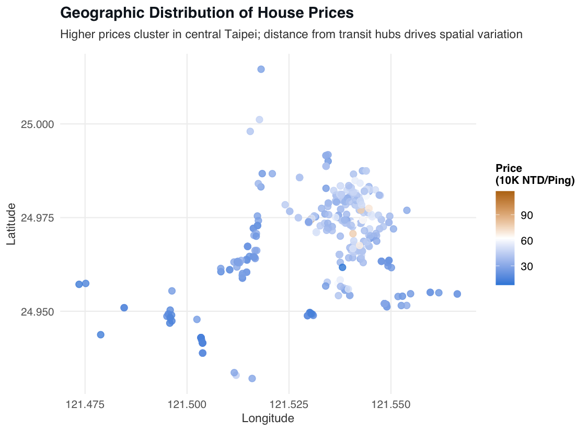
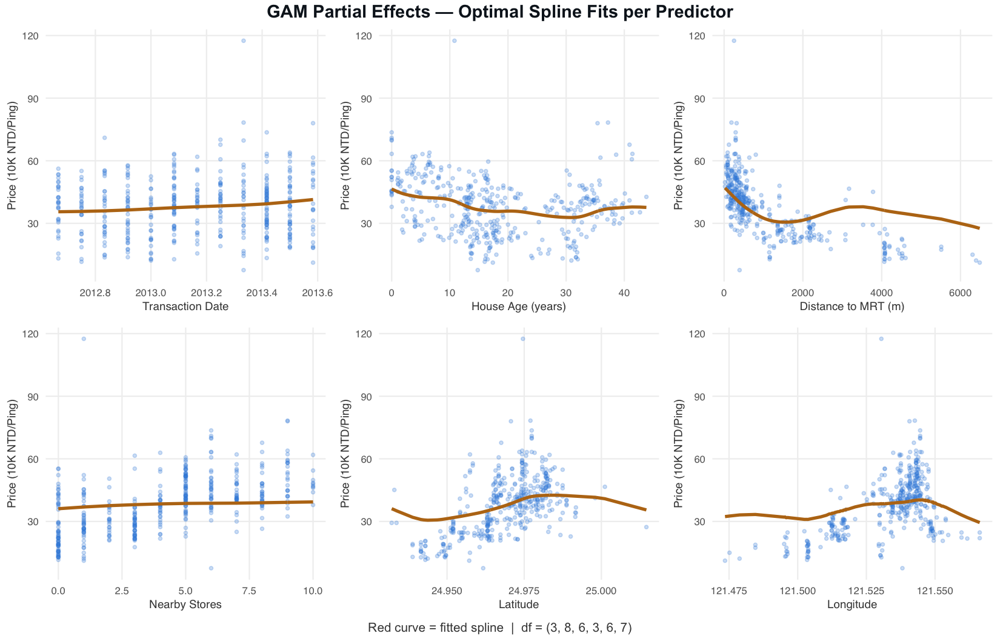
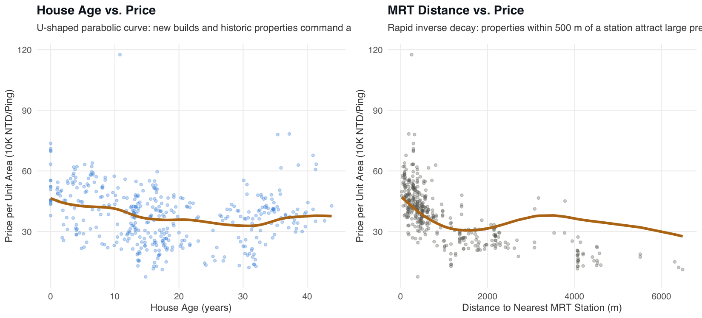
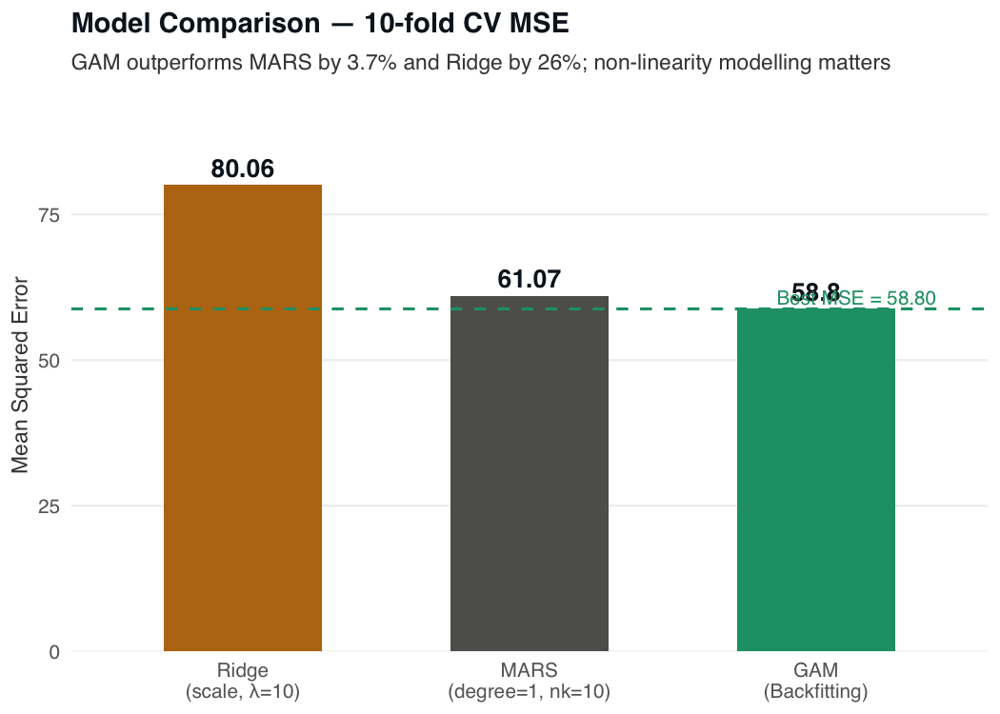

# 📌 Taipei House Value Prediction

> Comparative regression analysis of 414 Taipei housing records using three flexible models to predict price per unit area from six property and location features.

## 📖 Overview
 - Compares three regression approaches — MARS, Generalized Additive Models (Backfitting), and Ridge Regression — applied to 414 residential property records from Taipei City and New Taipei City (June 2012–May 2013)
 - Exploratory analysis confirmed non-linear relationships in house age and MRT proximity, motivating the choice of flexible non-parametric methods over a purely linear baseline
 - Developed in R using an R Markdown notebook; all figures are generated programmatically and all packages are locked via `renv` for reproducibility
 - GAMs achieved the best 10-fold CV MSE (58.80), outperforming MARS (61.07) and Ridge (80.06); the 26% gap between GAMs and Ridge quantifies the predictive cost of assuming linearity on this dataset

## 🏢 Business Impact
Accurate residential property valuation helps appraisers, lenders, and investors price assets without relying on manual comparable-sale searches. This project demonstrates that flexible non-linear models reduce prediction error by 26% compared to a standard linear regularised baseline on Taipei housing data, meaning a practitioner who switches from a ridge-penalised linear model to a GAM can expect meaningfully tighter price estimates. The fully reproducible R Markdown workflow means the entire analysis — from raw data to publication-quality figures — can be re-run by any collaborator with a single command, eliminating manual re-work when the dataset is refreshed.

## 🚀 Features
✅ **Non-linear Modelling with MARS:** Fits piecewise linear hinge functions at data-driven knot locations with GCV-based pruning; degree and nk selected by 10-fold cross-validation.  
✅ **Smooth Spline Modelling with GAMs:** Decomposes price into a sum of smooth spline functions, one per predictor, with a separate degrees-of-freedom parameter cross-validated for each variable.  
✅ **Linear Regularisation Baseline (Ridge):** Cross-validates the L₂ penalty λ alongside three feature-scaling strategies ("none", "scale", "corrForm") to establish the predictive cost of the linearity assumption.  
✅ **Geospatial EDA:** Geographic scatter map of all 414 properties coloured by price reveals spatial clustering near central Taipei transit hubs.  
✅ **Automated, Reproducible Figures:** All 10 publication-quality figures are generated inline in the R Markdown notebook and saved to `figures/` via `ggsave`; re-running the notebook regenerates every chart.  
✅ **Locked Dependency Environment:** `renv` and `renv.lock` pin every package version so the analysis reproduces exactly on any machine with R 4.6.  

## ⚙️ Tech Stack
| Technology                  | Purpose                                                            |
| --------------------------- | ------------------------------------------------------------------ |
| `R 4.6`                     | Primary analysis language                                          |
| `earth`                     | MARS model fitting, GCV-based pruning, and variable importance     |
| `gam`                       | Generalized Additive Models via backfitting algorithm              |
| `ridge`                     | Ridge Regression with "none", "scale", and "corrForm" scaling      |
| `ggplot2`                   | All EDA and model-evaluation visualisations                        |
| `dplyr`                     | Data manipulation and inline summaries                             |
| `tidyr`                     | Reshaping the correlation matrix for the heatmap                   |
| `gridExtra`                 | Multi-panel figure composition (scatter grids, GAM partial effects)|
| `knitr` / `rmarkdown`       | Literate programming — renders `analysis.Rmd` to HTML              |
| `renv`                      | Reproducible package management; all versions locked in renv.lock  |

## 📂 Project Structure
<pre>
📦 Taipei House Value Prediction
 ┣ 📂 data
 ┃ ┗ 📂 raw
 ┃   ┣ 📜 th.csv
 ┃   ┗ 📜 README.md
 ┣ 📂 figures
 ┃ ┣ 📜 01_price-distribution.png
 ┃ ┣ 📜 02_price-vs-predictors.png
 ┃ ┣ 📜 03_correlation-heatmap.png
 ┃ ┣ 📜 04_geo-price-map.png
 ┃ ┣ 📜 05_mars-variable-importance.png
 ┃ ┣ 📜 06_mars-cv.png
 ┃ ┣ 📜 07_gam-partial-effects.png
 ┃ ┣ 📜 08_key-nonlinearities.png
 ┃ ┣ 📜 09_ridge-cv.png
 ┃ ┗ 📜 10_model-comparison.png
 ┣ 📂 results
 ┃ ┗ 📜 metrics.md
 ┣ 📂 renv
 ┃ ┗ 📜 activate.R
 ┣ 📜 analysis.Rmd
 ┣ 📜 renv.lock
 ┣ 📜 LICENSE
 ┗ 📜 README.md
</pre>

> **Why `renv`?** The analysis uses three specialised modelling packages (`earth`, `gam`, `ridge`) whose APIs change across versions. `renv.lock` pins every package to the exact version used when results were obtained, so `renv::restore()` reproduces the environment exactly rather than picking up breaking changes from a later CRAN release.

## 🛠️ Installation

1️⃣ **Clone the repository**
<pre>
git clone https://github.com/real-ahmed-moussa/thvp.git
cd thvp
</pre>

2️⃣ **Install renv and restore the package library**
<pre>
Rscript -e "install.packages('renv')"
Rscript -e "renv::restore()"
</pre>

3️⃣ **Render the analysis notebook**
<pre>
Rscript -e "rmarkdown::render('analysis.Rmd')"
</pre>

This produces `analysis.html` and regenerates all figures in `figures/`. Results are reported as originally obtained; minor numerical variation across R versions is expected even with `set.seed(42)`.

## 📂 Analysis Figures

### Price Distribution
  

### Price vs. Each Predictor
  

### Geographic Price Distribution
  

### GAM Partial Effects
  

### Key Non-linearities — House Age and MRT Distance
  

### Model Comparison
  

## 📊 Results
 - **Task:** Regression model predicting residential house price per unit area (10,000 NTD/Ping) from six numeric predictors across 414 Taipei properties
 - **Best model — GAM (Backfitting):** CV MSE = **58.80** with optimal df = (3, 8, 6, 3, 6, 7) per predictor; backfitting splines capture the smooth non-linearities that define this dataset
 - **MARS (degree = 1, nk = 10):** CV MSE = **61.07**; cross-validation selected no interaction terms, meaning piecewise-linear hinges approximate but do not fully represent the continuous curvature in house age and MRT distance
 - **Ridge Regression (scale, λ = 10):** CV MSE = **80.06**; the 26% gap versus GAMs is attributable entirely to the linearity assumption — all three scaling variants plateau near MSE ≈ 80 regardless of λ
 - **Dominant non-linearities:** House age follows a U-shaped parabolic curve (premiums for new builds and historic properties); MRT proximity shows rapid inverse-decay pricing within 500 m of a station

## 📝 License
This project is shared for portfolio purposes only and may not be used for commercial purposes without permission.
